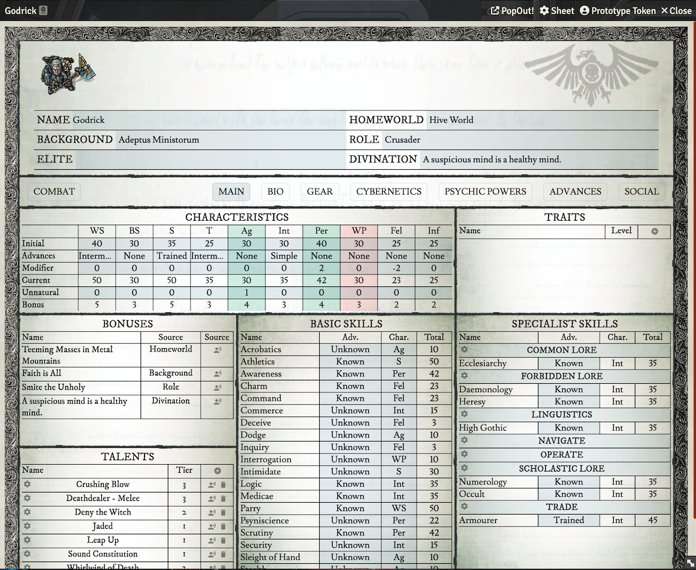
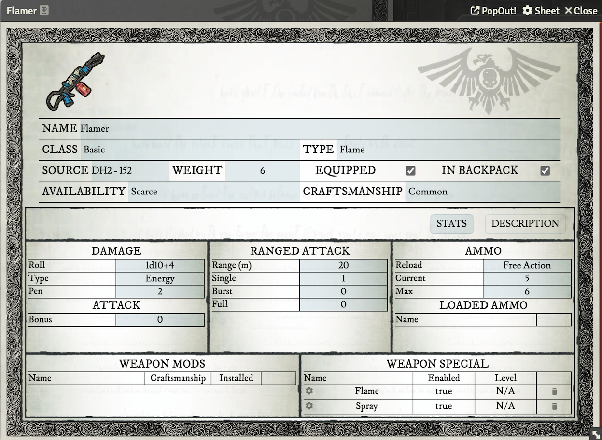
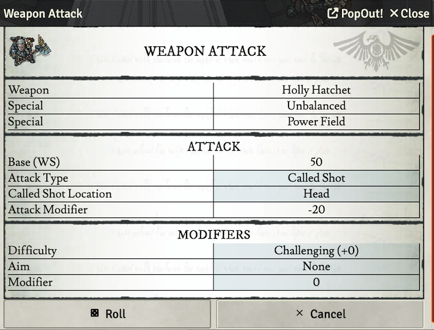
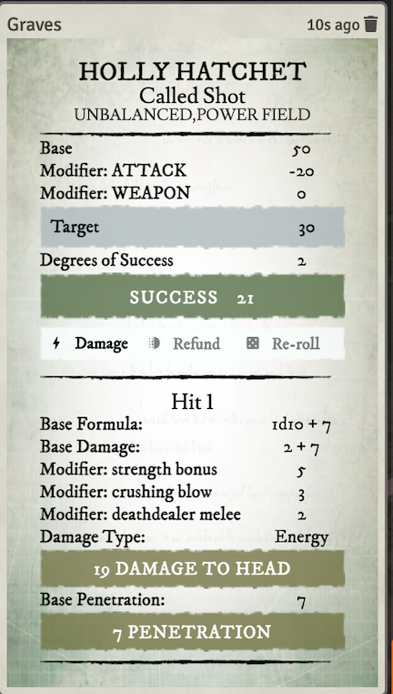

# Dark Heresy 2nd Edition

This is an _unofficial_ system for playing Dark Heresy 2nd Edition on [Foundry VTT](https://foundryvtt.com/). This requires >= Foundry 12.

It offers extensive support for character sheets, compendium packs, and automated management to save you time and allow you to focus on role playing. The existing system listed on Foundry was character sheet only and thus this system was created to facilitate the automation features I desired.

## Features

🗡️ The system includes a variety of compendium packs, such as weapons, weapon mods, talents, armor, psychic abilities, ammunition, tools, traits, attack specials (toxic, corrosive, etc.), and consumables and drugs.

💪 During character creation, there are automated bonuses for backgrounds, roles, and elite advances.

🧰 You can easily manage your inventory by dragging and dropping items, such as weapon mods and custom ammunition to build weapons, or storing items in a location on your ship to reduce encumbrance.

🔫 You can also drag weapons and skills to the macro bar for easy access, and the system offers automation support for weapon specials, most talents, attack types, and custom ammunition when you attack. Modifiers like distance and character size are automatically taken into account when targeting an attack.

## Install
 - Go to the setup page and choose _Game Systems_.
 - Click the _Install System_ button, and paste in this [manifest link](https://s3-keathley.nyc3.digitaloceanspaces.com/dark-heresy-2nd/system.json)
 - Create a Game World using the "Dark Heresy 2nd Edition" system.

## Links
  - [Foundry VTT](https://foundryvtt.com/)
  - [Dark Heresy 2nd Edition Rules](https://www.drivethrurpg.com/browse/pub/54/Cubicle-7-Entertainment-Ltd/subcategory/179_21610/Dark-Heresy-Second-Edition)

## Screenshots

|    |  |
|:---------------------------------------------|:---:|
|   |  |

### Thanks
- I liked the layout of the WH4e sheet on Roll20 and tried to mimic that where possible. Thanks to the authors for that inspiration.
- I studied the original DH2e Foundry VTT project by moo-man. I ended up not using much from there but learned a lot about Foundry. I appreciate the head start!
- My tabletop group for play testing and feedback.

## License
[GNU General Public License v3.0](https://choosealicense.com/licenses/gpl-3.0/)
